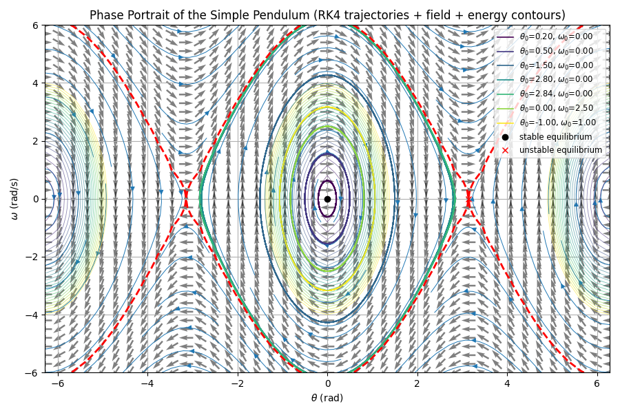

# Simple Pendulum Phase Portrait (RK4)

This project visualizes the phase portrait of a simple pendulum using the Runge-Kutta 4th order (RK4) integration method. It plots the vector field, energy contours, and sample trajectories for various initial conditions.



# Inspiration
A wonderful explanation, both practically and through code- https://www.fabriziomusacchio.com/blog/2024-03-17-phase_plane_analysis/

## Features

- RK4 integration for the nonlinear pendulum equation
- Vector field and streamlines of the phase space
- Energy contours, including the separatrix
- Overlay of multiple trajectories with different initial conditions
- Marking of stable and unstable equilibrium points

## Requirements

- Python 3.x
- NumPy
- Matplotlib

Install dependencies with:

```sh
pip install numpy matplotlib
```

## Usage

Run the script to display the phase portrait:

```sh
python simplePendulum.py
```

## File Structure

- `simplePendulum.py`: Main script for simulation and visualization

## Output

The script generates a plot showing:
- Phase space vector field and streamlines
- Energy contours (with separatrix highlighted)
- Trajectories for several initial conditions
- Stable and unstable equilibrium points

## Customization

You can modify initial conditions, pendulum parameters, or plotting options directly in [`simplePendulum.py`](simplePendulum.py).

## License

MIT